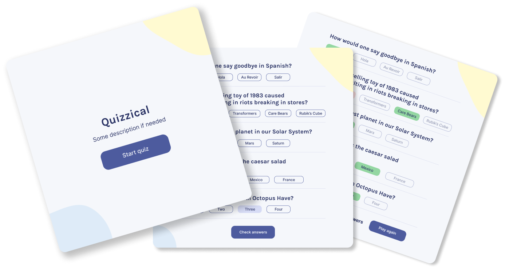

# quizical app

## Description

This is a simple quiz app that allows you to create quizzes and take quizzes. It is built using the React framework. it is a work in progress. it will be connected to the following API:[opentrivia database](https://opentdb.com/api_config.php)

 

## Features

- [x] Reponsive design
- [ ] Start a quiz with a single click
- [ ] submit answers and check results
- [ ] Compare awnsers with correct awnsers
- [x] Api connection
- [x] edit quiz settings
- [x] quiz pagination with next and previous buttons
- [x] progress bar
- [x] no questions found message

## Installation

To install this app, clone the repo and run `npm install` in the root directory. Then run `npm start` to start the app.

## Tech Stack

This app is built using the following tech stack:

- React
- Vite

## Contributing

Contributions are welcome. Please fork the repo and submit a pull request.
